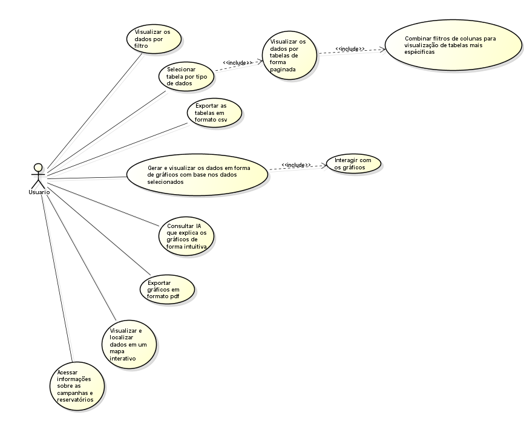

# 🌎 Sistema de Visualização e Disseminação de Dados Limnológicos

---

  
<b>📋 Sobre o Projeto </b>

<b>ℹ️ Informações do Projeto</b>

| Categoria      | Detalhes                                                              |
| -------------- | --------------------------------------------------------------------- |
| 📍 Instituição | FATEC Jacareí                                                         |
| 📚 Curso       | DSM - 2º Semestre 2025                                                |
| 🔄 Metodologia | Aprendizagem Baseada em Projetos (ABP)                                |
| 👤 Focal Point | Prof. André Olimpio                                                   |
| 📧 Contato     | [andre.olimpio@fatec.sp.gov.br](mailto:andre.olimpio@fatec.sp.gov.br) |
| 📅 Início      | 16/09/2025                                                            |
| 📊 Status      | Em desenvolvimento                                                    |

---

## 🚀 Tema do Semestre

Desenvolver um sistema web para consulta e visualização de dados e gráficos limnológicos do INPE, organizando e otimizando a busca e utilização dos dados já existentes.

---

## 🔍 Desafio

atualmente, os dados limnologicos do INPE se encontravam desorganizados, poluidos e sem quaisquer maneira de facil visualização e consulta grafica. O sistema proposto visa resolver esse problema, permitindo consultas por topicos, e seleção de parametros e periodos para geração de graficos.

---

<b>🔄 Sprint 1 – Planejamento inicial, Infraestrutura e Preparação</b>

### 📅 Período

- **Início:** 16/09/2025
- **Término:** 06/10/2025
- **Review:** 07/10/2025

### 🎯 Objetivos Principais

- Implementar as funcionalidades básicas do sistema
- Desenvolver a interface com base nos protótipos
- Integrar frontend com backend

  

📌 Histórias Selecionadas para a Sprint 1

## História (US01) – Visualizar e Filtrar Todos os Dados

**Como usuário,**  
Quero poder visualizar todos os dados armazenados,  
**Para** filtrá-los de acordo com minhas necessidades.

**Tarefas:**
- Criar endpoint no backend para listar todos os dados (com suporte a query params de filtro).
- Mapear/descritar as tabelas e colunas disponíveis (endpoint de schema).
- Implementar componente de listagem no frontend para exibição bruta legível.
- Implementar controles de filtragem no frontend (instituição, reservatório, período e filtros livres).
- Validar filtragem com dataset de teste e criar testes automatizados básicos.

**Prioridade:** Média (3)

**Critérios de Aceite:**
- Exibição de todos os dados do banco de forma bruta, legível.
- Sistema de filtragem de dados funcional (filtros aplicáveis retornam resultados corretos).

## História (US02) – Exibir Dados em Tabelas Ordenáveis

**Como usuário,**  
Quero ordenar e visualizar os dados em forma de tabelas,  
**Para** melhorar a organização e usabilidade.

**Tarefas:**
- Criar componente de tabela reusável no frontend (React) com colunas configuráveis.
- Implementar funcionalidade de ordenação por coluna (asc/desc) e paginação.
- Permitir seleção/exibição das colunas (mostrar/ocultar) mantendo legibilidade.
- Integrar a tabela com a API de dados filtrados/ordenados.
- Garantir responsividade e acessibilidade; realizar testes de usabilidade.

**Prioridade:** Alta (5)

**Critérios de Aceite:**
- Exibição de todas as colunas das tabelas de forma legível.
- Colunas são selecionáveis (mostrar/ocultar) e ordenáveis.

## História (US10) – Selecionar Tabelas por Categoria

**Como usuário,**  
Quero selecionar diferentes tabelas dentro de cada categoria de dados,  
**Para** realizar análises específicas por tabela.

**Tarefas:**
- No card de cada categoria, implementar controle (dropdown/list) para escolher a tabela associada.
- Ao escolher uma tabela, exibir o esquema/colunas da tabela (nomes das colunas, sem dados).
- Implementar frontend para marcar filtros obrigatórios e validar seleção antes da consulta.
- Criar endpoints no backend para retornar lista de tabelas por categoria e esquema de cada tabela.
- Testar fluxo de seleção e validação de filtros.

**Prioridade:** Alta (5)

**Critérios de Aceite:**
- Interface permite escolher tabela dentro do card de categoria.
- Todas as colunas da tabela são exibidas (nomes, sem dados).
- É possível definir e exigir seleção de filtros obrigatórios antes da execução da consulta.

## História (US12) – Acesso Detalhado a Bancos e Portais via Navegação

**Como usuário,**  
Quero acessar informações de cada banco de dados e portais em páginas detalhadas, através de botões na barra de navegação,  
**Para** consultar detalhes dos projetos/portais de forma rápida.

**Tarefas:**
- Adicionar botões/links na barra de navegação para cada banco/portal relevante.
- Criar páginas detalhadas para projetos/portais (layout limpo com campos chave e metadados).
- Implementar roteamento no frontend e endpoints backend para dados detalhados.
- Garantir design limpo, responsivo e compatível com dispositivos móveis.
- Testar navegação e carregamento das páginas detalhadas.

**Prioridade:** Alta (5)

**Critérios de Aceite:**
- Botões na barra de navegação levam para páginas detalhadas dos projetos/portais.
- Interface limpa e responsiva nas páginas detalhadas.

## História (US13) – Filtros Combinados em Múltiplas Colunas

**Como usuário,**  
Quero aplicar filtros combinados em múltiplas colunas,  
**Para** realizar análises mais específicas (ex.: reservatório + data + coluna específica).

**Tarefas:**
- Projetar e implementar UI de filtros combinados (múltiplos campos, operadores e lógica AND/OR).
- Implementar suporte no backend para receber e aplicar filtros compostos de forma eficiente.
- Implementar atualização dinâmica da visualização (fetch assíncrono, debounce) sem reload de página.
- Garantir performance das queries e criar testes de integração para combinações de filtros.
- Validar resultados com casos de uso reais e dataset de teste.

**Prioridade:** Alta (5)

**Critérios de Aceite:**
- Suporte a filtros combinados (ex.: reservatório + data + coluna específica).
- Atualização dinâmica da visualização sem recarregar a página.

  

<b>📋 Requisitos da Sprint 1</b>

**Requisitos Funcionais contemplados:**

- **RF01:** Permitir aos usuários visualizar todos os parâmetros armazenados, filtrando por instituição, reservatório e período de tempo.
- **RF02:** Consultar e visualizar os dados no formato de tabelas.

**Requisitos Não Funcionais contemplados:**

- **RNF01:** A usabilidade será um requisito crítico, exigindo uma interface intuitiva, clara e de fácil navegação.
- **RNF02:** A aplicação deve apresentar desempenho otimizado, garantindo carregamento rápido dos dados.
- **RNF03:** A interface deve seguir os padrões institucionais do INPE e a identidade visual definida pelo cliente.
- **RP04 (restrição de projeto):** A aplicação deve utilizar containers independentes para o banco de dados, o back-end e o front-end.

---

  

<b>📝 Principais Funcionalidades</b>

- Exibição inicial dos dados limnológicos em formato bruto.
- Filtros para refinar os dados por **instituição**, **reservatório** e **período de tempo**.
- Tabelas interativas com ordenação por colunas principais (parâmetro, valor, data, instituição).
- Banco de dados PostgreSQL configurado e integrado ao backend em Node.js.
- Backend e frontend em containers separados, orquestrados junto ao banco via Docker Compose.

  

<b>✅ Critérios de Aceite Gerais da Sprint 1</b>

- Os dados limnológicos devem ser carregados do banco e exibidos corretamente no frontend.
- Os filtros devem retornar os resultados corretos de acordo com as seleções do usuário.
- A ordenação em tabelas deve ser funcional, intuitiva e responsiva.
- O banco PostgreSQL deve estar configurado em container, acessível pelo backend sem erros.
- O backend deve expor endpoints funcionando para o frontend consumir.
- Os três containers (front, back e banco) devem subir sem falhas e se comunicar corretamente.
- Interface deve atender requisitos de usabilidade mínimos definidos no projeto.

  

<b>🎨 Design do Site</b>

🧭 Objetivo do Protótipo

O protótipo tem como finalidade demonstrar visualmente a interface do sistema que permitirá a consulta de horários, turmas, professores e a ocupação de ambientes da instituição. Além disso, visa oferecer uma visualização gráfica e interativa das salas, apoiar a exportação de relatórios e garantir uma experiência fluida tanto em dispositivos desktop quanto móveis.

### 📊 Interfaces Principais

  <table>
    <tr>
      <th width="50%">pagina 1</th>
      <th width="50%">pagina 2</th>
    </tr>
    <tr>
      <td>
        
        
<strong>Homepage com cartões com tópicos de dados:</strong> Visualização principal dos dados por topico

      </td>
      <td>
        
        
<strong>Homepage com cartões com tópicos de dados:</strong> Visualização principal dos dados por topico

      </td>
    </tr>
    <tr>
      <td>
        
        
<strong>Gerador de grafico:</strong> pagina dentro do card para geração dos graficos

      </td>
    </tr>
    <tr>
      <td>
        
        
<strong>Mapa Interativo:</strong> Visualização espacial dos ambientes acadêmicos

      </td>
    </tr>
    <tr>
      <td>
        
        
<strong>Homepage Sima:</strong>Página inicial do projeto Sima

      </td>
    </tr>
    <tr>
      <td>
        
        
<strong>Homepage Balcar:</strong> Página inicial do projeto Balcar

      </td>
    </tr>
    <tr>
      <td>
        
        
<strong>Homepage Furnas:</strong> Página inicial do projeto Furnas

      </td>
    </tr>
  </table>

### 🗂️ Arquitetura de Navegação

O sistema é estruturado em páginas principais:
- **Home**: Página inicial com cards que armazenam as tabelas agrupadas em topicos
- **Consulta**: Pagina para seleção de tabela e de colunas que seram utilizadas para a criação do grafico
- **Mapa Interativo**: Visualização do mapa nacional e das coordenadas de coleta dos dados com poligonos
- **Projetos**: cada projeto(Sima, Balcar, Furnas) possui seu respectivo icone na topbar, que redirecionam a suas paginas com todas as informações dos projetos.

- 🎨 Design System
  - Tipografia: fontes sans-serif (Helvetica Neue / Arial) para leitura científica clara.  
  - Componentes: `styled-components` com ThemeProvider (cores, espaçamentos, sombras e bordas padrão).  
  - Interações: hover sutil, elevação (box-shadow) em cards, transições leves em botões.

#### Paleta de Cores

  <table>
    <tr>
      <td style="background-color:#0B5394; color:white; text-align:center; padding:8px">Azul Escuro #0B5394</td>
      <td style="background-color:#2563EB; color:white; text-align:center; padding:8px">Azul Primário #2563EB</td>
      <td style="background-color:#DBEAFE; color:#0b2740; text-align:center; padding:8px">Fundo Claro Azul #DBEAFE</td>
      <td style="background-color:#0B2740; color:white; text-align:center; padding:8px">Texto Escuro #0B2740</td>
      <td style="background-color:#FFFFFF; color:black; text-align:center; padding:8px; border:1px solid #ccc">Branco #FFFFFF</td>
    </tr>
  </table>

A paleta usa tons de azul para o topo e elementos de destaque, combinada com branco e azuis claros para fundos e contraste. Para séries no gráfico utilizamos uma pequena paleta complementar (ex.: #0b5394, #2563EB, #06B6D4, #F59E0B, #EF4444).

- 💡 Diferenciais de UX
  - **Seleção explícita de tabela** como passo obrigatório para evitar queries incorretas.  
  - **Gráfico protótipo SVG multissérie** que mostra pontos clicáveis/hover com tooltip (instituição + reservatório).  
  - **Mapa com polígonos dos estados do Brasil** e pontos de coleta escaláveis; controles de zoom e opção de mostrar nomes.   
  - **Layouts responsivos** com grid (2 colunas em desktop, 1 coluna em mobile) e cards maiores para facilitar leitura de dados.

  

<b>📋 Visão Geral dos Casos de Uso</b>

Para melhor estruturação do projeto, modelamos o diagrama de casos de uso:

#### Diagrama de Casos de Uso

**Funcionalidades Principais**
- Pesquisador / Usuário — filtra, gera gráficos, visualiza mapa, exporta dados.  
- Sistema (backend) — fornece endpoints para metadados, agregados, mapas e exportação.

  

<b>📊 Modelo de Dados</b>

- **Bancos envolvidos**
  - `bdfurnas-campanha` (Furnas)
  - `bdsima` (SIMA)
  - `bdbalcar-campanha` (Balcar)

- **Entidades principais**
  - `reservatorio` (id, nome, instituicao, geom/metadados)
  - `instituicao` (id, nome, contato)
  - `campanha`, `sitio`, `amostra`, `medicao` (aninhadas — campanhas → sitios → amostras → medicoes)
  - Tabelas por tópico (abioticos, bioticos, agua-sedimento, fluxos-gases, etc.)

- **Relacionamentos**
  - `instituicao` 1:N `reservatorio`
  - `campanha` 1:N `sitio` → 1:N `amostra` → 1:N `medicao`
  - Cada medição referencia `reservatorio` e `instituicao`

- **Características Técnicas**
  - Geometria: armazenada no Postgres (geom/lat/lon), usado para mapas e polígonos.  
  - Views/materialized views previstas para otimizar consultas de mapa e agregações.

  

<b>🚀 Funcionalidades Implementadas</b>

- 💻 **Backend (Express + Node)**  
  Endpoints planejados / implementados (essenciais):
  - `GET /reservatorios`
  - `GET /instituicoes`
  - `GET /data/union` (integração / união de fontes)
  - `GET /tables/:table/columns` (metadados de colunas)
  - `GET /tables/:table/metadata` (intervalo de datas e responsáveis)
  - `GET /tables/:table/aggregate` (dados prontos para gráfico)
  - `GET /tables/:table/map` (dados geoespaciais / polígonos)
  - Outros endpoints de atalho: by-reservatorio / by-instituicao / dados/filtrados / dados/paginados / dados/mapa

- 🗃️ **Banco de Dados**
  - Conexões para 3 bancos (Furnas, SIMA, Balcar) via env vars.
  - Scripts de criação em `docker-compose` montados para popular dados de exemplo.

- 🖥️ **Frontend (React + Vite + styled-components)**  
  Implementações principais:
  - Topbar (MenuBar) com branding, ícone e espaço para 3 logos (SIMAS, FURNAS, BALCAR).
  - Home com cards por tópico e estilização moderna.
  - TablesPage: seleção de tabela, escolha de colunas, geração de gráfico SVG multissérie, mapa do Brasil por estados (polígonos JSON), export CSV/PDF.
  - MapBrazil component (consome `br_states.json`) com opção de zoom e toggle de nomes.

- 🧰 **Ferramentas & Infra**
  - Docker + docker-compose (Postgres + server + front).  
  - Hot-reload configurado para front com Vite e `CHOKIDAR_USEPOLLING` no container.  

  

<b>📉 Burndown Chart</b>

- 🖼️ Gráfico de Burndown

    

- 📋 Observações rápidas  
  - Sprint 1 focou em protótipo visual e arquitetura de endpoints.  
  - Próximos passos: realizar alimentação correta do gerador de graficos, implementar mapa funcional

  

<b>🔍 Sprint Retrospective</b>

- 🎯 O que funcionou bem
  - Protótipo visual (cards, TablesPage, MapBrazil) avançou rapidamente.  
  - Docker + bancos de testes configurados para reproduzir dados locais.  
  - Entendimento claro dos endpoints necessários para alimentar o frontend.

- ⚠️ Desafios enfrentados
  - Conflitos de merge em arquivos TS (marcadores `<<<<<<< >>>>>>>`) e issues de formatação (Prettier).  
  - Algumas rotas/endpoints ainda não implementadas ou em mismatch com o front.  
  - Adaptação ao novo modelo de ABP baseado em tasks por matéria.
  - Conflitos de padronização de commits e branches
  - erros frequentes de CI CD

- 🚀 Plano de melhorias (Sprint seguinte)
  - Finalizar os endpoints.  
  - Integração completa: frontend chamando endpoints reais e testes de integração.  
  - Melhorias UX: legendas, tooltips, zoom suave no mapa, e export mais robusto.
  - adição de novas funcionalidades.
  - geração de gráficos funcional.
  - visualização e interação de mapa funcional.

- 📈 Métricas alvo para Sprint 2
  - 100% dos endpoints core implementados e testados localmente.   
  - Integração frontend-backend com dados reais.
  - funcionalidades concluidas.

---

<b>🔄 Sprint 2 – Aplicação do Protótipo na Prática</b>

### 📅 Período

- **Início:** 13/10/2025
- **Término:** 03/11/2025
- **Review:** 04/11/2025

### 🎯 Objetivos Principais

- Implementar as funcionalidades centrais da Sprint 2
- Entregar gráficos interativos e exportação de dados
- Integrar visualização espacial (mapa) com dados reais
- Garantir experiência responsiva e consistente entre frontend/backend

  

📌 Histórias Selecionadas para a Sprint 2

## História (US03) – Visualizar dados em forma de gráficos

**Como usuário,**  
Quero visualizar os dados em forma de gráficos,  
**Para** obter entendimento rápido e confiável das séries temporais.

**Tarefas (exemplos):**
- Implementar endpoint `/tables/:table/aggregate` (backend) que entregue séries temporais agregadas por período (dia/mês/ano).
- Componente React que desenhe gráficos multi-série responsivos e interativos.
- Tooltip com instituição/reservatório quando hover em pontos.
- Eixo X mostrando todos os meses entre data início e fim (formato `AAAA/MM/DD`).
- Testes visuais básicos e testes unitários para transformação de dados.

**Prioridade:** Alta  
**Sprint points:** 5  
**Critérios de Aceite:**
- Gráficos estilizados aparecem corretamente para o intervalo e colunas selecionadas.
- Tooltip mostra instituição + reservatório ao passar sobre pontos; desaparece ao sair.

---

## História (US04) – Exportar dados em CSV

**Como usuário,**  
Quero exportar os dados em CSV,  
**Para** usar em ferramentas externas (Excel, R, Python).

**Tarefas (exemplos):**
- Endpoint `POST /export` para exportar CSV/JSON/PDF (backend).
- Frontend: botão/ação que envia seleção atual (colunas, filtros, paginação) para `/export` ou gera CSV no cliente.
- Garantir escape/encodificação correta de campos (vírgulas, aspas).
- Teste de exportação com payloads reais (validação do conteúdo).

**Prioridade:** Alta  
**Sprint points:** 5  
**Critérios de Aceite:**
- CSV contém exatamente os registros/colunas atualmente exibidos.
- Export funciona mesmo com colunas contendo vírgulas/aspas.

---

## História (US05) – Mapa interativo dos dados

**Como usuário,**  
Quero localizar os dados em um mapa interativo,  
**Para** analisar a distribuição geográfica.

**Tarefas (exemplos):**
- Endpoint `/tables/:table/map` retornando pontos (lat/lon) e polígonos (estados/áreas).
- Frontend: camada base com polígonos dos estados do Brasil (arquivo `br_states.json`) e camada de pontos.
- Interações: zoom/pan, hover em polígonos (highlight), hover/click em pontos (popup com metadados).
- Implementar opção de alternar entre pontos e polígonos; tests básicos de integração.

**Prioridade:** Baixa  
**Sprint points:** 1  
**Critérios de Aceite:**
- Mapa exibe polígonos dos estados e pontos de coleta.
- Hover em elemento mostra popup explicativo; mapa permite zoom/pan.

---

## História (US11) – Visualizar dados como tabelas com colunas

**Como usuário,**  
Quero visualizar dados em tabelas com colunas configuráveis,  
**Para** analisar estrutura e relacionamentos dos dados.

**Tarefas (exemplos):**
- Componente de tabela com seleção de colunas, ordenação asc/desc, paginação.
- Integração com endpoints paginados (`/tables/:table/data`, `/tables/:table/data?limit=&offset=`).
- Regras: colunas chave (`id`) são obrigatórias e não desmarcáveis quando necessário.
- Testes de ordenação, paginação e manutenção do estado (colunas + página).

**Prioridade:** Alta  
**Sprint points:** 5  
**Critérios de Aceite:**
- Tabela mostra dados paginados, ordenáveis e com seleção/ocultação de colunas.
- Paginação funciona e se integra com backend paginado.

  

<b>📋 Requisitos da Sprint 2</b>

**Requisitos Funcionais (Sprint 2):**

- **RF-GRAPH:** Agregar séries temporais no backend e disponibilizar via `/tables/:table/aggregate`.
- **RF-EXPORT:** Exportar dados visíveis para CSV; gerar PDF de gráfico/mapa (via `POST /export` ou client-side print).
- **RF-MAP:** Servir polígonos base e pontos via `/tables/:table/map` e permitir renderização interativa no frontend.
- **RF-TABLE:** Fornecer endpoints paginados (`/tables/:table/data`) e metadados (`/tables/:table/columns`, `/tables/:table/metadata`).

**Requisitos Não Funcionais:**

- **RNF-RESP:** UI responsiva e compatível com telas mobile/desktop.
- **RNF-PERF:** Latência aceitável em ambiente dev; agregações devem ser razoavelmente eficientes.
- **RNF-ERROR:** Tratamento robusto de falhas (fallback para mocks com mensagem).
- **RNF-SEC:** Validar inputs (datas, colunas) para evitar SQL injection/consultas mal formadas.

  

<b>📝 Principais Funcionalidades (Sprint 2)</b>

- Gráfico multi-série interativo com tooltip e eixo X mensal (formato `AAAA/MM/DD`).
- Exportador CSV completo e exportação PDF/print-friendly do gráfico e do mapa.
- Mapa base do Brasil (polígonos por estado) + pontos de coleta com hover/click.
- Tabela reutilizável com ordenação, seleção de colunas e paginação remota.
- Endpoints de metadados e agregação para alimentar frontend.
- Componente de UI responsiva para seleção de tabela, responsáveis, colunas e intervalo.

  

<b>✅ Critérios de Aceite Gerais da Sprint 2</b>

- Gráficos gerados mostram corretamente séries por mês entre as datas escolhidas.
- Tooltip em pontos mostra instituição e reservatório (temporariamente exibido apenas enquanto hover).
- Export CSV entrega os dados exibidos; export PDF gera visualização imprimível.
- Mapa do Brasil com polígonos visíveis; pontos plotados nas coordenadas corretas.
- Tabela aceita ordenação e paginação (cliente ↔ servidor) e mantém estado de colunas.
- Integração: frontend consome `/columns`, `/metadata`, `/aggregate`, `/map`, `/export` com tratamento de erros e fallback para mock.
- UI responsiva e experiência aceitável em mobile/desktop.

  

<b>📊 Sprint Backlog (seleção principal)</b>

- US03: Gráfico multi-série (agregação + frontend) — 5 pontos  
- US04: Export CSV (backend + frontend) — 5 pontos  
- US05: Mapa base + interações — 1 ponto  
- US11: Tabela paginada e ordenável — 5 pontos

(As tasks detalhadas do Sprint Backlog serão divididas em 36 tasks numeradas e atribuídas conforme planejamento de sprint — garantido ao menos 2 tasks por matéria MC, BD, DW, TP, ES, ED.)

  

<b>🎨 Design do Site</b>

🧭 Objetivo do Protótipo

O protótipo tem como finalidade demonstrar visualmente a interface do sistema que permitirá a consulta de horários, turmas, professores e a ocupação de ambientes da instituição. Além disso, visa oferecer uma visualização gráfica e interativa das salas, apoiar a exportação de relatórios e garantir uma experiência fluida tanto em dispositivos desktop quanto móveis.

### 📊 Interfaces Principais

  <table>
    <tr>
      <th width="50%">pagina 1</th>
      <th width="50%">pagina 2</th>
    </tr>
    <tr>
      <td>
        
        
<strong>Homepage com cartões com tópicos de dados:</strong> Visualização principal dos dados por topico

      </td>
      <td>
        
        
<strong>Homepage com cartões com tópicos de dados:</strong> Visualização principal dos dados por topico

      </td>
    </tr>
    <tr>
      <td>
        
        
<strong>Gerador de grafico:</strong> pagina dentro do card para geração dos graficos

      </td>
    </tr>
    <tr>
      <td>
        
        
<strong>Mapa Interativo:</strong> Visualização espacial dos ambientes acadêmicos

      </td>
    </tr>
    <tr>
      <td>
        
        
<strong>Homepage Sima:</strong>Página inicial do projeto Sima

      </td>
    </tr>
    <tr>
      <td>
        
        
<strong>Homepage Balcar:</strong> Página inicial do projeto Balcar

      </td>
    </tr>
    <tr>
      <td>
        
        
<strong>Homepage Furnas:</strong> Página inicial do projeto Furnas

      </td>
    </tr>
  </table>

- 🎨 Design System
  - Tipografia: fontes sans-serif (Helvetica Neue / Arial) para leitura científica clara.  
  - Componentes: `styled-components` com ThemeProvider (cores, espaçamentos, sombras e bordas padrão).  
  - Interações: hover sutil, elevação (box-shadow) em cards, transições leves em botões.

#### Paleta de Cores

  <table>
    <tr>
      <td style="background-color:#0B5394; color:white; text-align:center; padding:8px">Azul Escuro #0B5394</td>
      <td style="background-color:#2563EB; color:white; text-align:center; padding:8px">Azul Primário #2563EB</td>
      <td style="background-color:#DBEAFE; color:#0b2740; text-align:center; padding:8px">Fundo Claro Azul #DBEAFE</td>
      <td style="background-color:#0B2740; color:white; text-align:center; padding:8px">Texto Escuro #0B2740</td>
      <td style="background-color:#FFFFFF; color:black; text-align:center; padding:8px; border:1px solid #ccc">Branco #FFFFFF</td>
    </tr>
  </table>

A paleta usa tons de azul para o topo e elementos de destaque, combinada com branco e azuis claros para fundos e contraste. Para séries no gráfico utilizamos uma pequena paleta complementar (ex.: #0b5394, #2563EB, #06B6D4, #F59E0B, #EF4444).

  

<b>📋 Visão Geral do diagrama de classes</b>

#### Diagrama de Casos de Uso

**Funcionalidades Principais**
-
- 

  

<b>📊 Modelo de Dados</b>

- **Bancos envolvidos**
  - 
  - 
  - 

- **Entidades principais**
  - 
  - 
  - 
  - 

- **Relacionamentos**
  - 
  - 
  - 

- **Características Técnicas**
  - 
  - 

  

<b>🚀 Funcionalidades Implementadas</b>

- 💻 **Backend (Express + Node)**  
  Endpoints planejados / implementados (essenciais):
  - 

- 🗃️ **Banco de Dados**
  - 
  - 

- 🖥️ **Frontend (React + Vite + styled-components)**  
  Implementações principais:
  - 
  - 
  - 
  - 

- 🧰 **Ferramentas & Infra**
  - 
  - 

  

<b>📉 Burndown Chart</b>

- 🖼️ Gráfico de Burndown

    

- 📋 Observações rápidas  
  - 
  - 

  

<b>🔍 Sprint Retrospective</b>

- 🎯 O que funcionou bem
  - 
  - 
  - 

- ⚠️ Desafios enfrentados
  - 
  - 
  - 
  - 
  - 

- 🚀 Plano de melhorias (Sprint seguinte)
  - 
  - 
  -
  -
  -
  - 

- 📈 Métricas alvo para Sprint 2
  - 
  - 
  - 

---

<b>🔄 Sprint 3 – Refinamento e Entrega Final</b>

### 📅 Período

- **Início:** 16/09/2025
- **Término:** 06/10/2025
- **Review:** 07/10/2025

### 🎯 Objetivos Principais

- Implementar as funcionalidades básicas do sistema
- Desenvolver a interface com base nos protótipos
- Integrar frontend com backend

  

📌 Histórias Selecionadas para a Sprint 1

## História –

**Como usuário,**

**Para**

**Tarefas:**

-
-
-
-
- **Prioridade:**

  **Critérios de Aceite:**

-
- ***

## História –

**Como usuário,**

**Para**

**Tarefas:**

-
-
-
-
- **Prioridade:**

  **Critérios de Aceite:**

-
- ***

## História –

**Como usuário,**

**Para**

**Tarefas:**

-
-
-
-
- **Prioridade:**

  **Critérios de Aceite:**

-
- ***

## História –

**Como usuário,**

**Para**

**Tarefas:**

-
-
-
-
- **Prioridade:**

  **Critérios de Aceite:**

-
- ***

  

<b>📋 Requisitos da Sprint 1</b>

**Requisitos Funcionais contemplados:**

-
- **Requisitos Não Funcionais contemplados:**
-
-
-
- ***

  

<b>📝 Principais Funcionalidades</b>

-
-
-
-
-

  

<b>✅ Critérios de Aceite Gerais da Sprint 1</b>

-
-
-
-
-
-
- 

  

<b>🎨 Design do Site</b>

- 🧭 Objetivo do Protótipo
- 📊 Interfaces Principais
- 🗂️ Arquitetura de Navegação
- 🎨 Design System
  - Paleta de Cores
- 💡 Diferenciais de UX

  

<b>📋 Visão Geral dos Casos de Uso</b>

- 📝 Principais Funcionalidades
- 👥 Atores do Sistema

  

<b>📊 Modelo de Dados</b>

- Diagrama ER
- 📝 Principais Classes e Relacionamentos
- 🔄 Relacionamentos Principais
- Características Técnicas
- 💡 Características do Sistema

  

<b>🚀 Funcionalidades Implementadas</b>

- 💻 Visão Geral das Implementações
- 🔍 Detalhes das Implementações
  - Backend
  - Banco de Dados
  - Frontend
  - Arquitetura e Ferramentas

  

<b>📉 Burndown Chart</b>

- 🖼️ Gráfico de Burndown
- 📋 Análise do Desempenho

  

<b>🔍 Sprint Retrospective</b>

- 🎯 Visão Geral da Retrospectiva
- ✅ O que funcionou bem
- ⚠️ Desafios enfrentados
- 🚀 Plano de melhorias
  - Processo e comunicação
  - Gestão de tarefas
  - Planejamento e execução
- 📈 Métricas para Sprint 2

---

## 👥 Nossa Equipe

    <table>
        <tr>
            <td align="center"><b>Gestão</b></td>
            <td align="center"><b>Desenvolvimento</b></td>
        </tr>
        <tr>
            <td align="center">
                <table>
                    <tr>
                        <td align="center">
                            <b>Caio Araujo</b> 
                            <i>Product Owner</i> 
                            
                            
                        </td>
                    </tr>
                    <tr>
                        <td align="center">
                            <b>Felipe Ferreira Pacheco</b> 
                            <i>Scrum Master</i> 
                            
                            
                        </td>
                    </tr>
                </table>
            </td>
            <td align="center">
                <table>
                    <tr>
                        <td align="center">
                            <b>Tiago Jardel Costa</b> 
                            
                            
                        </td>
                        <td align="center">
                            <b>Aline</b> 
                            
                            
                        </td>
                    </tr>
                    <tr>
                        <td align="center">
                            <b>Carlos Eduardo Espirito Santo</b> 
                            
                            
                        </td>
                        <td align="center">
                            <b>Arthur Facchinetti Peixoto</b> 
                            
                            
                        </td>
                    </tr>
                </table>
            </td>
        </tr>
    </table>

## 👨‍🏫 Coordenação e Orientação

    <table>
        <tr>
            <td align="center"><b>Professor</b></td>
        </tr>
        <tr>
            <td align="center">
                <table>
                    <tr>
                        <td align="center">
                            <b>Prof. André Olimpio</b> 
                            <i>Focal Point</i> 
                            
                            
                        </td>
                    </tr>
                </table>
            </td>
        </tr>
    </table>

## 📜 Licença

    

    

